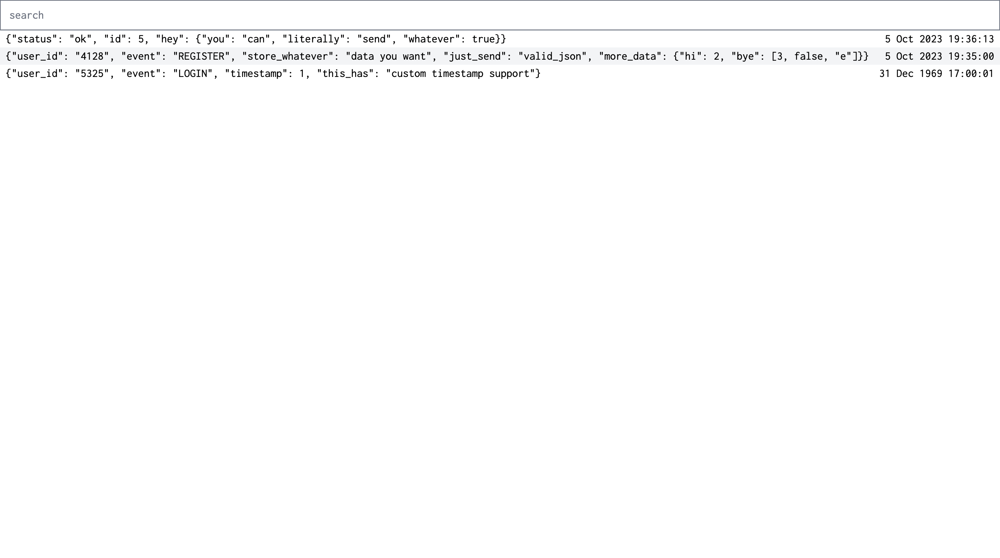

## Erlog

#### A Log Platform which runs on a $4 VPS



## Features

- Ingest as many logs as you want from an http endpoint or file
- Query logs with a nice syntax
- Support for `parent_id`, so logs can have "children"

## Sending Logs

Just send a POST request to erlog with JSON

```
{
  "timestamp": "1675955819",
  "level": "debug",
  "service": "my_service",
  "key": "value",
  "data": {
    "another_key": "another value"
  }
}
```

Alternatively, run `export LOGS=file1.txt file2.txt` and those files will be tailed and ingested in to erlog.

## Viewing Logs


## Querying

Erql is extremely simple. Here are some examples

```rb
# search for "foo" in any log (case sensitive)
foo
"foo"

# search where name = "foo" or name = "foo bar"
name:foo
name:"foo bar"

# search for {name: {first: 'foo'}}
name.first:foo
name.first:"foo bar"

# search for name[0] = "item"
name.0:item

# member = true
member:true
member:false

# null search
member:null

# search for height =, >, >=, <, <=
height:=100
height:>100
height:>=100
height:<100
height:<=100

# search for height in range (inclusive, exclusive)
height:[100 TO 200]
height:{100 TO 200}

# AND/OR operators
name:foo AND height:=100
name:foo OR name:bar

# grouping
name:foo AND (bio:bar OR bio:baz)
```

## Instrumenting

Just have your structured logger log in json, and then forward those logs to a file. A collector is coming soon which just `tail`s a file and forwards the requests to your erlog instance.

Look here for an example of an instrumented function.

## Example Project

For an example project, see app/main.py. Erlog is instrumented using structlog.
If you run `export LOGS=file1.txt` and `python3 -m uvicorn main:app > file1.txt`,
you will start seeing erlogs logs in erlog.

## Using `parent_id`

```python
import uuid
from structlog import get_logger

logger = get_logger()

# don't forget str()
# making the id a Uuid type won't work
# as it'll be printed as Uuid('iaodjfoiasjdijdsaiojf')
# instead of 'iaodjfoiasjdijdsaiojf'

id = str(uuid.uuid4())
logger.log("root log", id=id)
logger.log("child of root", parent_id=id)
```

This will show the log "root log" in the erlog ui.
Once you click on "root log", you will be able to see "child of root"
in the log viewer.

This is useful for when you want to capture logs across many different services, and have them all be in one location.

## Todo

- clear db on 'reset_erlog' message (for development)
- stream logs from db
- get support for traces using `parentId` and `duration` or `start` `end` in ms
- show parents whenever you click on a child
- on log submit, if log level is error, then with id == parent_id field to be error=true
- same thing with warning
- add toggle for parent id null or not

- for each log, make a call to the db with the info to try and merge the events together
- or just do that on every other log call where whenver there's a new info you
  merge it into the current log, and an error you merge into the corresponding error log

  The idea is that if they both have the same parent id, do the merge

- start reporting logs from the ui, set up service_name for both
